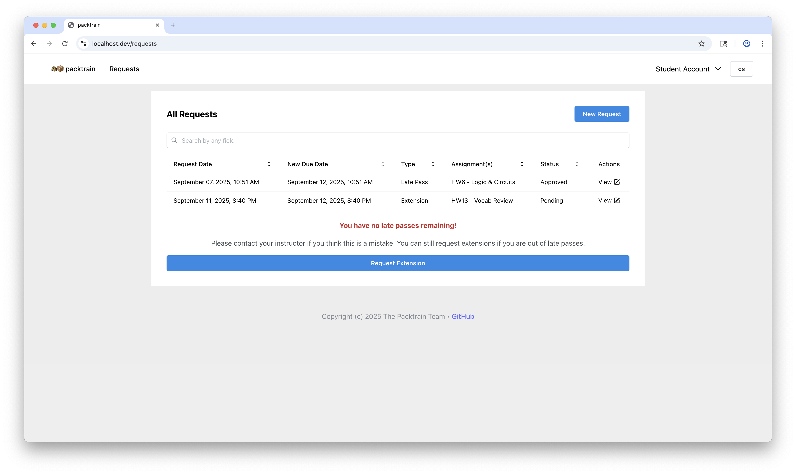
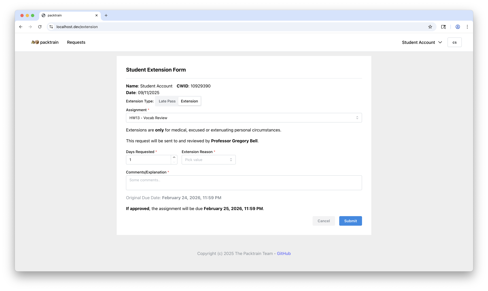
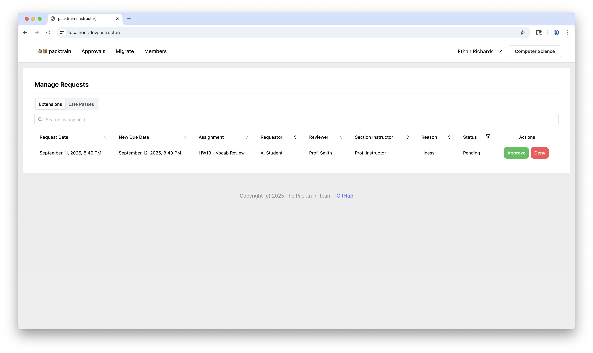
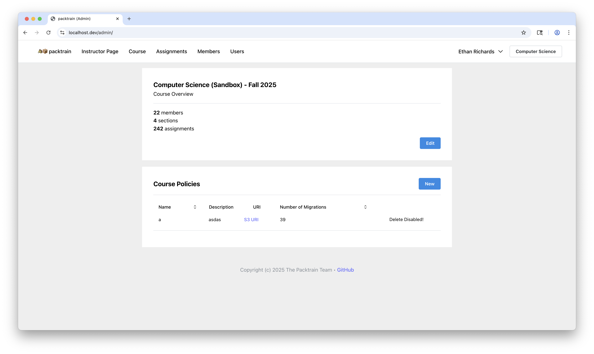
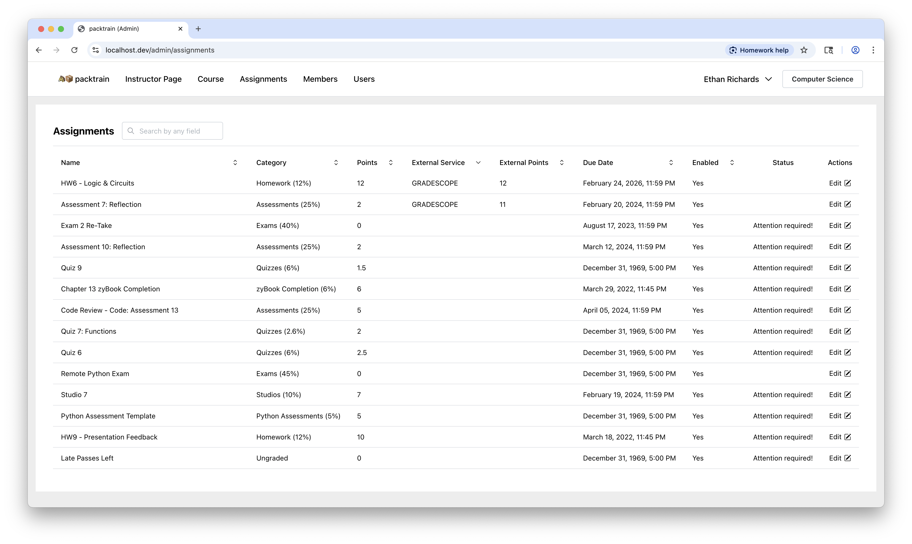

# 🐴📦 packtrain

> packtrain: a line or succession of pack animals, as mules or burros, used to transport food and supplies over terrain unsuitable for wagons or other vehicles.

Packtrain is software for grading and student extension management. It
has a simple interface for instructors to create classes, manage student
extension requests, and migrate grades from external websites to Canvas.
Additionally, it provides full-feature functionality for students requesting
extensions on work. Packtrain saves precious time for instructors and
course staff by automating menial grading and administration tasks!

Packtrain documentation can be found on [packtrain.readthedocs.io](https://packtrain.readthedocs.io/en/latest/), with the [development environment setup](https://packtrain.readthedocs.io/en/latest/src/DevelopmentEnvironment.html).

## Features

**Student Extensions Management**: Packtrain features an end-to-end extensions management system. Students view a simple
but effective screen for their requests and their status, such as when they were approved or rejected. Instructors also
have an intuitive system for managing extensions all in one place.

**Course Late Passes**: If configured, courses can provide "late passes", or freebies for late work depending on course policy. This automatically integrates into the extensions flow, and students can request either an extension or a late pass.

**Course Management & Grade Migrations**: Full course management features including a fully synchronized course from Canvas as well as
automated grade migration. Grade migrations pull from an external service like Gradescope or Runestone, apply instructor-defined grading policies, and post grades directly to Canvas.

**Grading Policies**: Customizable and JavaScript-defined policies for instructors with different grading scales and late work policies.
Policies are automatically applied upon migrating grades!

**Full Canvas Integration**: Courses on Packtrain are created from a Canvas course and can be synchronized at any
time with one. Students, instructors, sections, assignments and more are all pulled from Canvas, and grades are
posted directly to it once migrated. No manual work for you!

**Gradescope Integration**: Gradebook exports from [Gradescope](https://www.gradescope.com) are supported, allowing
for a robust and seamless flow for the majority of your Canvas-external assignments.

**Runestone Integration**: Gradebook exports from [Runestone Academy](https://landing.runestone.academy) are supported,
adding a seamless flow for grading reading assignments.

## Application Screenshots

_Image showing the student requests screen_

_Image showing the student extension form screen_

_Image showing the instructor approvals screen_

_Image showing the student extension form screen_

_Image showing the student extension form screen_
