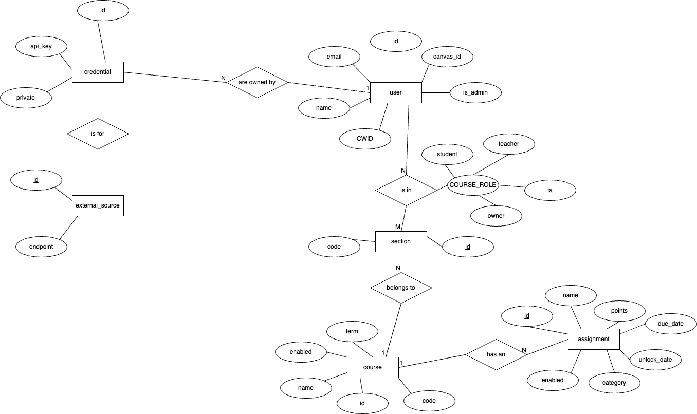

# Primary Application ERD

## Instructions

Draw.io was used to create this diagram.

Can be visited in the browser at [https://draw.io](https://draw.io).

Can be installed as a desktop app as well!

MacOS (via `brew`):

```bash
brew install --cask drawio
```

Windows (via `winget`):

```powershell
sudo winget install JGraph.Draw
```

## Current ERD



