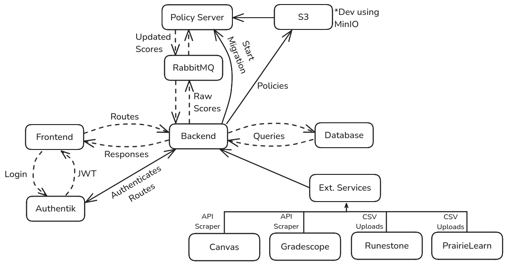

.. _Architecting:

Architectural Decisions
==========================
This page explains the major architectural decisions that were made for the project. It outlines the main
components that were chosen, what they do, and why they were chosen.

Grading Policy Server
---------------------
The **Grading Policy Server** is a TS based server that gets the stored class policies which are coded in JS from S3 buckets (or
MinIO in development version) and then receives a start migration route from the Java Spring backend which
starts communications between them via RabbitMQ to send, apply policies, then receive to and from the main Java Spring
backend.

Why this was chosen:

- Having the Policy Server be separate from the main backend and coded in TS/JS allows us to be able to run and apply the JS coded policies a lot easier than if it was instead being ran within the Java coded backend
- Since the Policy Server is only needed whilst migrations are actually happening, having it run as a separate server helps to make the backend simpler and follow better separation of concerns

RabbitMQ
--------
For a message broker we decided to choose **RabbitMQ**. What RabbitMQ does is it allows for communication between different parts of the Packtrain system via a publisher and a subscriber system where RabbitMQ handles the exchange of data.

Why this was chosen:

- RabbitMQ is very popular as a message broker for Java applications
- RabbitMQ is also open-source, flexible, and has easy to read documentation

Java Spring
-----------
For the main part of the backend we chose **Java Spring Boot** which is a framework to Java which makes making more complex stuff a lot easier as it has a wide variety of support for different plugins.

Why this was chosen:

- Java Spring is extremely popular and has a lot of support for plugins and for updates
- Java is a very common language to make REST application's backends in and is made easy with Lombok and Hibernate

React
-----
For the frontend we chose to use **React** which is a very popular frontend framework developed by Meta. It is very modular and can make complex dynamic frontends.

Why this was chosen:

- React is one of the most used frontend frameworks which means it has a lot of support and good documentation
- React is really good when working with dynamic and modular data that can be compartmentalized which we needed
- React also has good integration with a lot of other plugins like Mantine and React-Query

Authentik
---------
For security we chose to use **Authentik** which is a open-source user authentication provider.

Why this was chosen:

- Authentik is more secure than building auth by hand
- Authentik is free if self-hosted, reliable, and open-source
