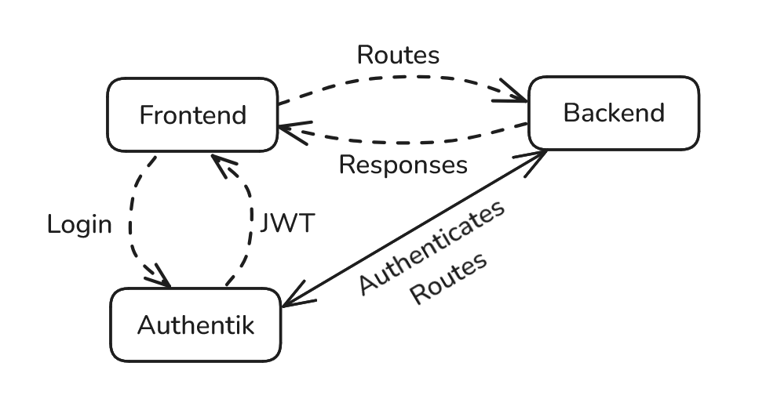

.. _Authentication:

Authentication
==========================
`Authentik <https://goauthentik.io/>`_ is an identity broker and authentication server that manages integrations for all identity providers (Canvas, etc).

In this setup:
    - Authentik is the primary authority for user authentication. It issues JWTs that the :ref:`frontend <Frontend>` can use to call the :ref:`backend <Backend>`.

    - Authentik manages scopes (i.e., what each user/role can do) and enforces these scopes when handing out tokens.
        - Authentik maps external roles (e.g., “Teacher” or “Student” in Canvas) to the internal roles (Instructor, Student)

    - Backend receives the JWT from the frontend and uses Authentik to validate the token and verify the user’s permissions before giving access to data or performing actions.

The above figure displays the previously mentioned authorization flow.

Admin Authentication Level
--------------------------

- **Manages Policies:**  
  Can create, modify, and enforce course-wide/assignment-based policies.
- **Instructor-level Access to All Sections:**  
  Can view and manage every section of the course.

Instructor Authentication Level
-------------------------------

- **Course Section Management:**  
  Can manage their specific course sections, including assignments, grades, and rosters.
- **Handles Extension Requests:**  
  Responsible for approving or denying student requests for assignment extensions.
- **Manages Late Passes:**  
  Oversees the issuance and consumption of late passes.
- **Master Migration:**  
  Responsible for managing migrations.

Student Authentication Level
----------------------------

- **Extension Requests:**  
  Can submit requests for assignment extensions.
- **Late Passes:**  
  Can view and apply available late passes.

