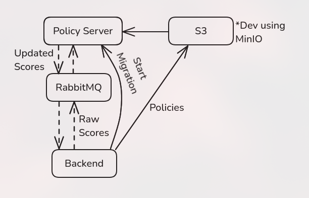

.. _GradingPolicy:

Grading Policy Server
==========================

The **Grading Policy Server** is the server that handles grading policies on the raw scores of assignments.

This is a typescript application that runs asynchronously from the primary :ref:`API Service <APIService>`.
The steps of the grading policy is as follows:

1. The user can upload a created policy from the web UI (*\*.js*), which will get stored within a S3 bucket.
2. Starting the migration from the Web UI will call the ``startGrading`` method of the API Service, which will communicate to the grading policy server via a message broker, `RabbitMQ <https://www.rabbitmq.com/>`_.
3. The API Service and the Policy server will convert raw scores using the respective policy from the S3 bucket to the new scores, of which the API Service will receive.

This visualization from the system architecture design can depict this process;

